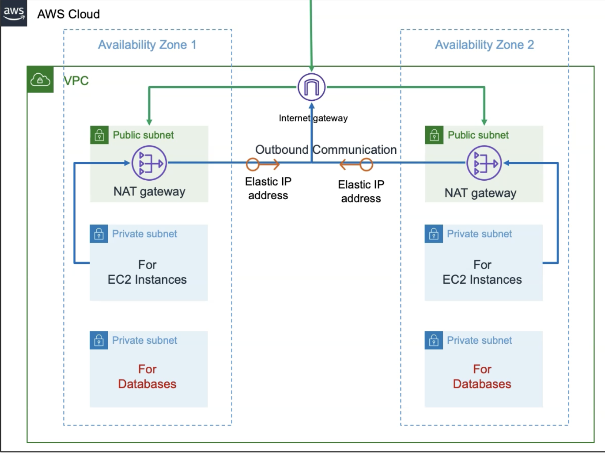

### AWS 3 Tier Architecture with Terraform
Terraform build with AWS web services to provision resources

#### Resources Created
- Create VPC
- Create Public and Private Subnets
- Create Internet Gateway and Associate to VPC
- Create NAT Gateway in Public Subnet
- Create Public Route Table, Add Public Route via Internet Gateway and Associate Public Subnet
- Create Private Route Table, Add Private Route via NAT Gateway and Associate Private Subnet
#### Terraform Basic Execution Commands
##### Terraform Initialize
- terraform init
##### Observation:
1) Initialized Local Backend
2) Downloaded the provider plugins (initialized plugins)
3) Review the folder structure ".terraform folder"

##### Terraform Validate
- terraform validate
##### Observation:
1) If any changes to files, those will come as printed in stdout (those file names will be printed in CLI)

##### Terraform Plan
- terraform plan
##### Observation:
1) No changes - Just prints the execution plan

##### Terraform Apply
- terraform apply 
[or]
- terraform apply -auto-approve

##### Terraform Destroy
-  terraform plan -destroy 
- terraform destroy -auto-approve

##### Clean-Up Files
- rm -rf .terraform*
- rm -rf terraform.tfstate*
#### Connect to your EC2 instance
- Give the `.pem` file the necessary permissions `chmod 400`
- Connect with this command `ssh -i private-key/cfn-key-1.pem ec2-user@PUBLIC_IP`
